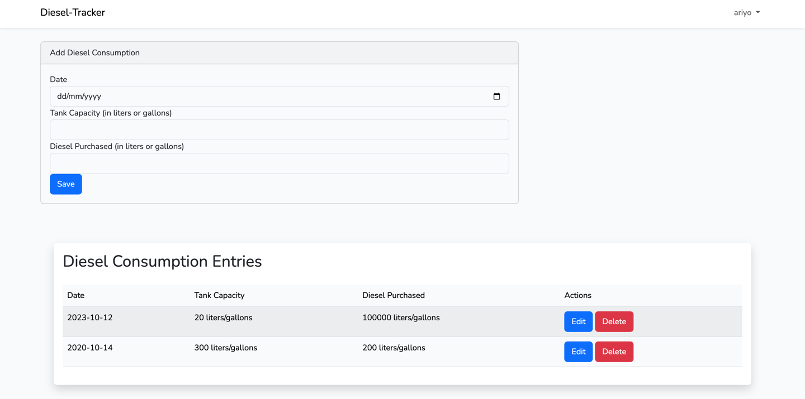

# DIESEL TRACKER

## Table of Contents

- [Getting Started](#getting-started)
- [User Interface](#user-interface)
- [Feedback and Support](#feedback-and-support)

## Getting Started

 This README will guide you on how to use our application effectively.

### Creating an Account

To get started with our application, follow these steps:

1. Visit our website at [diesel-tracker.test].
2. Click on the "Sign Up" or "Register" button.
3. Fill in the registration form with your details.
4. Confirm your email address by clicking the verification link sent to your email.

### Logging In

Once you've created an account, you can log in with your credentials:

1. Visit our website at [diesel-tracker.test].
2. Click on the "Log In" button.
3. Enter your email and password.
4. Click "Log In" to access your account.

## User Interface

Our application's user interface is designed for ease of use. Here are some key elements you'll find:

  
## Feedback and Support

We value your feedback! If you have any questions or encounter difficulties, please don't hesitate to reach out to our support team at [support-email].

# DIESEL TRACKER
